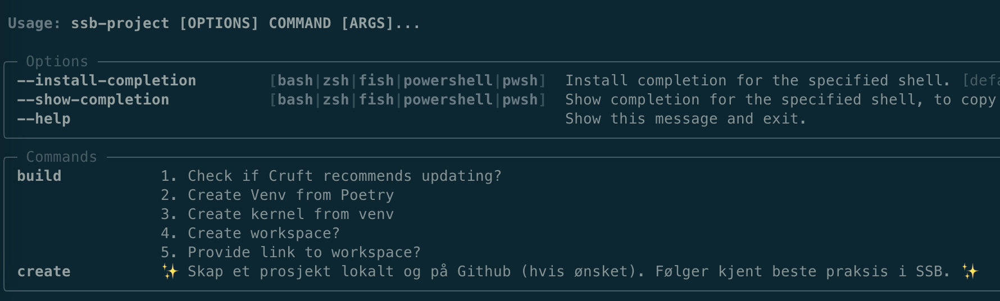

# Hack2022 Dapla Hurtigstart

[][pypi_]
[][status]
[][python version]
[][license]

[][read the docs]
[][tests]
[][codecov]

[][pre-commit]
[][black]

[pypi_]: https://pypi.org/project/hack2022-dapla-hurtigstart/
[status]: https://pypi.org/project/hack2022-dapla-hurtigstart/
[python version]: https://pypi.org/project/hack2022-dapla-hurtigstart
[read the docs]: https://hack2022-dapla-hurtigstart.readthedocs.io/
[tests]: https://github.com/statisticsnorway/hack2022-dapla-hurtigstart/actions?workflow=Tests
[codecov]: https://app.codecov.io/gh/statisticsnorway/hack2022-dapla-hurtigstart
[pre-commit]: https://github.com/pre-commit/pre-commit
[black]: https://github.com/psf/black

## Features



- Create a new project quickly and easily with `ssb-project create`.
- Your colleagues can quickly get started when you share the project with them with `ssb-project build`.
- Includes:
  - Local directory structure
  - Virtual Environment
  - Kernel for use on Jupyter
  - Github repo (if desired)
- The project will follow the most recent SSB guidelines for security and quality.
- It will always be possible to update existing projects as guidelines change.

## Installation

-TODO</br>
You can install _Hack2022 Dapla Hurtigstart_ via [pip] from [PyPI]:

```console
pip install hack2022-dapla-hurtigstart
```

## Contributing

### Setup

1. [Install dependencies](https://cookiecutter-hypermodern-python.readthedocs.io/en/latest/guide.html#installation)
1. [Install pre-commit hooks](https://cookiecutter-hypermodern-python.readthedocs.io/en/latest/guide.html#running-pre-commit-from-git)
1. Run tests: `nox -r` ([More information here](https://cookiecutter-hypermodern-python.readthedocs.io/en/latest/guide.html#using-nox))
1. Run the help command: `poetry run ssb-project --help`

## License

Distributed under the terms of the [MIT license][license],
_Hack2022 Dapla Hurtigstart_ is free and open source software.

<!-- github-only -->

[license]: https://github.com/statisticsnorway/hack2022-dapla-hurtigstart/blob/main/LICENSE
